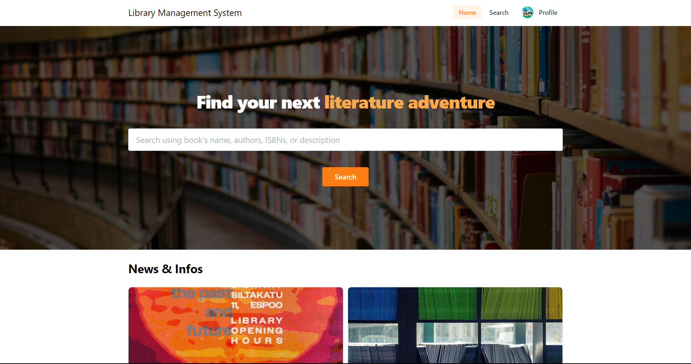
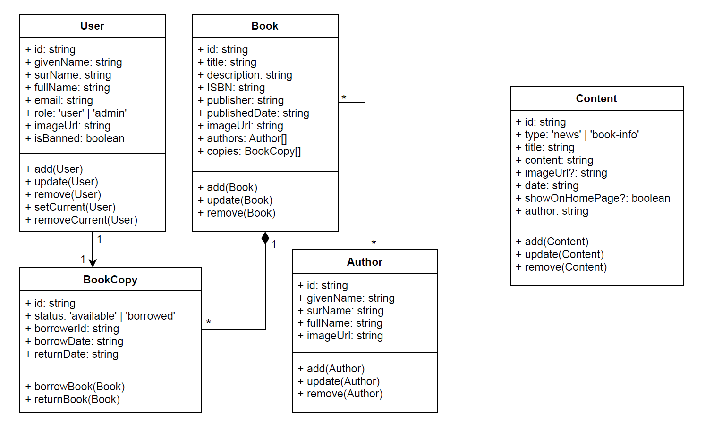

Library Management System - Front-End Project
=============================================

A comprehensive front-end library management system that serves both users and administrators, built with React, Redux, Mantine, and LocalStorage.

Link to website: [https://phuongnh-library.netlify.app/](https://phuongnh-library.netlify.app/)

Since this is a front-end project, the back-end API is not included. Thus, please login with your Google account to use the application. The admin functionalities can be accessed by adding this authorization code: `admin` on /profile page. The application store all the mock data and user generated content in the browser's local storage, so you can use the application without the need to connect to the back-end API. The application is also responsive and can be used on mobile devices (except for the admin dashboard).



Features
--------

-   User registration and login
-   Browsing and searching for books
-   Viewing book details and author information
-   Borrowing and returning books
-   Adding favorite books and managing personal virtual bookshelves
-   Updating user account information
-   Admin dashboard for managing users, books, and authors

Tech Stack
----------

-   [React](https://reactjs.org/) - UI library for building component-based user interfaces
-   [Redux](https://redux.js.org/) - State management library for maintaining and scaling application state
-   [Mantine](https://mantine.dev/) - React components and hooks library for building modern web applications
-   [LocalStorage](https://developer.mozilla.org/en-US/docs/Web/API/Window/localStorage) - Web storage API for persisting data across browser sessions

Getting Started
---------------

To run this project locally, follow these steps:

1. Clone the repository:

``` {.sourceCode .bash}
git clone https://github.com/yourusername/lib-manage-sys-frontend.git
cd library-management-system
```

2.  Install dependencies:

`yarn install`

3.  Start the development server:

`npm run dev`

4.  Open your browser and navigate to [http://localhost:5173](http://localhost:5173/) to view the application.

Project Structure
-----------------

-   `src/`
  -   `components/` - Reusable components used across the application
  -   `constants/` - Constants used across the application
  -   `features`: Contains feature-specific code, such as Redux slices and thunks, and feature-specific components.
  -   `pages/` - Main pages of the application, such as the homepage, user dashboard, and admin dashboard
  -   `redux/` - Redux store configuration, reducers, and actions
  -   `types/` - TypeScript interfaces for data types, such as books, authors, and users
  -   `utils/` - Utility functions
  -   `App.tsx` - Main application component
  -   `index.tsx` - Entry point of the application

Class Diagram
-------------


